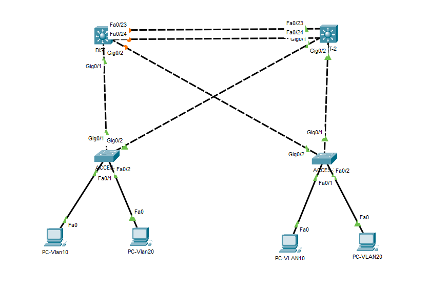
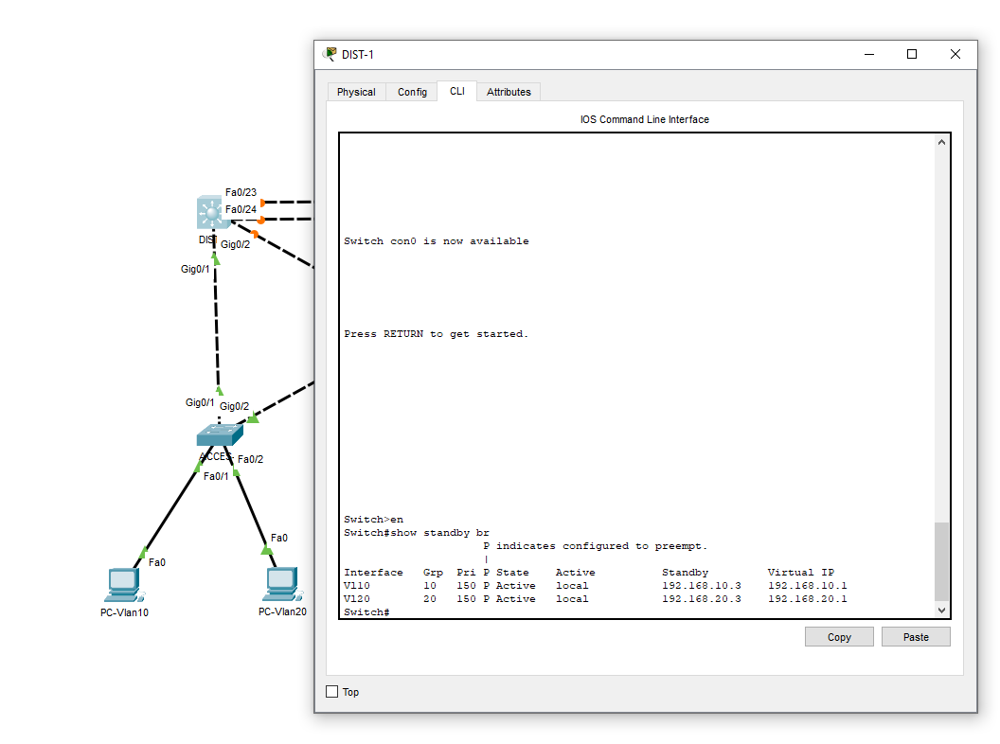
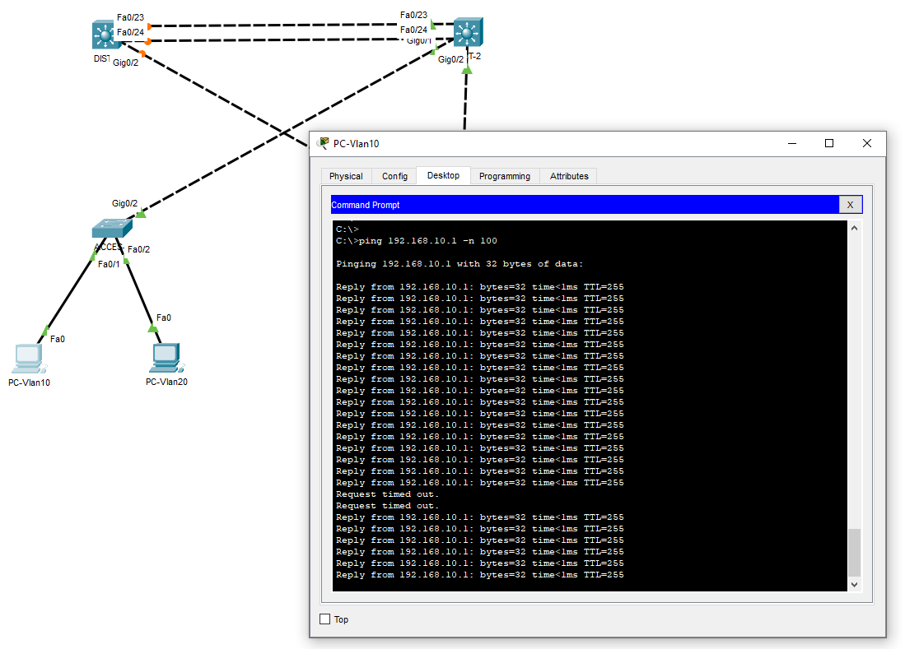

# Lab Cisco : Architecture Campus avec Haute Disponibilité (HSRP)

Petit projet réalisé sur **Packet Tracer** pour m'entraîner à sécuriser un réseau d'entreprise.
Le but était de faire en sorte que si un switch tombe en panne, le réseau continue de fonctionner sans coupure pour les utilisateurs.

## 📂 Schéma du réseau (Topologie)
J'ai utilisé une architecture classique avec une couche Distribution (Switchs L3) et une couche Accès.



## 🛠️ Ce que j'ai mis en place

* **VLANs :** Séparation des services (VLAN 10 Admin, VLAN 20 Data).
* **HSRP (Redondance) :** C'est la partie la plus importante. J'ai configuré une "IP virtuelle" pour que les PC aient toujours une passerelle, même si le switch principal s'éteint.
* **EtherChannel :** J'ai regroupé les câbles entre les switchs pour avoir plus de débit.
* **Routage Inter-VLAN :** Pour que les différents services puissent communiquer.

## 💻 Exemple de configuration (HSRP)
Voici les commandes principales que j'ai utilisées sur le switch principal (Active) pour le VLAN 10 :

```bash
interface Vlan10
 ip address 192.168.10.2 255.255.255.0
 standby 10 ip 192.168.10.1      <-- L'IP Virtuelle (Passerelle des PC)
 standby 10 priority 150         <-- Je force ce switch à être le chef
 standby 10 preempt              <-- S'il reboote, il reprend sa place
```

## ✅ Tests de fonctionnement
1. Preuve HSRP On voit ici sur le switch DIST-1 qu'il est bien en mode "Active".


2. Test de coupure J'ai lancé un ping infini et coupé le câble du switch principal. On voit qu'après une petite perte (le temps que le 2ème switch prenne le relais), le ping repart tout seul.
3. 
