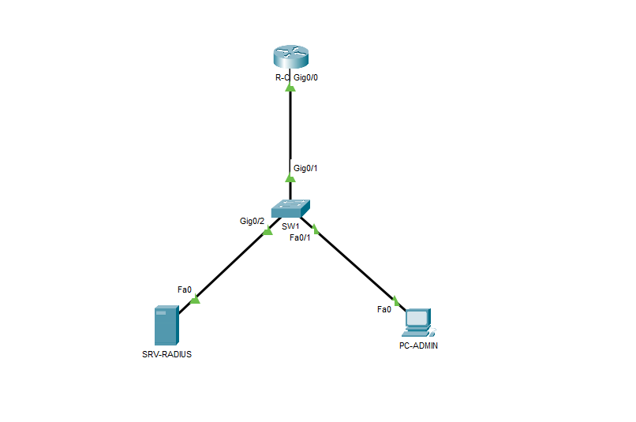
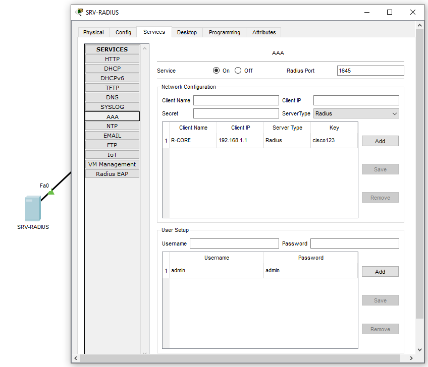
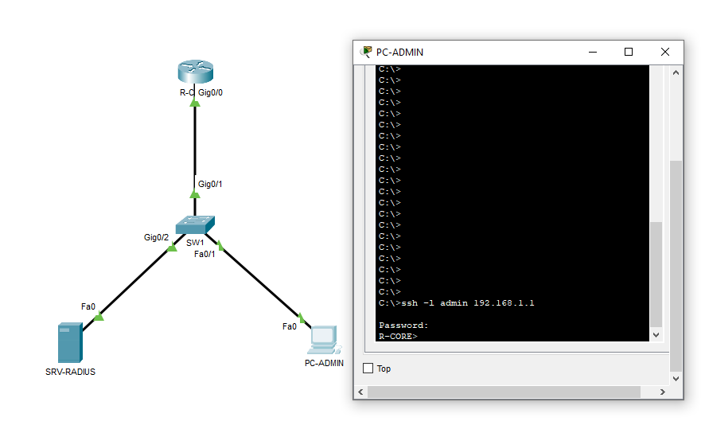

# Gestion Centralisée des Accès (AAA) & SSH

Ce projet porte sur la sécurisation de l'administration des équipements réseaux.
Plutôt que d'avoir un mot de passe unique stocké sur chaque routeur (faible sécurité), j'ai implémenté une architecture **AAA (Authentication, Authorization, Accounting)** utilisant un serveur centralisé **RADIUS**.

## 📂 Topologie

* **R-CORE :** Routeur de l'entreprise à sécuriser.
* **SRV-RADIUS :** Serveur qui contient la base de données des utilisateurs autorisés.
* **PC-ADMIN :** Poste de l'administrateur réseau.



## 🔐 Objectifs & Technologies

* **SSH v2 :** Configuration de l'accès distant sécurisé (chiffré) pour remplacer Telnet.
* **Protocole RADIUS :** Le routeur délègue l'authentification. Quand je me connecte, le routeur demande au serveur : *"Est-ce que cet utilisateur a le droit d'entrer ?"*.
* **Sécurité AAA :** Configuration du modèle "New-Model" sur Cisco IOS.
* **Redondance (Fallback) :** Si le serveur RADIUS tombe en panne, le routeur est configuré pour basculer automatiquement sur une base de données locale de secours.

## 💻 Configuration Technique (Extrait)

Commandes clés appliquées sur le routeur `R-CORE` pour activer l'authentification externe :

```bash
! 1. Activation du modèle de sécurité
aaa new-model

! 2. Déclaration du serveur RADIUS (IP et Clé secrète)
radius-server host 192.168.1.10 key cisco123

! 3. Règle d'authentification (Radius d'abord, Local si échec)
aaa authentication login default group radius local

! 4. Application sur les lignes virtuelles (SSH)
line vty 0 4
 transport input ssh
 login authentication default

 ```
## ✅ Preuves de Fonctionnement
1. Configuration Côté Serveur
L'utilisateur admin est créé uniquement sur le serveur RADIUS, pas sur le routeur.


2. Test de Connexion SSH
Depuis le PC Admin, la connexion SSH réussit avec le mot de passe du serveur RADIUS. Cela prouve que le routeur a bien interrogé le serveur pour valider l'accès.


