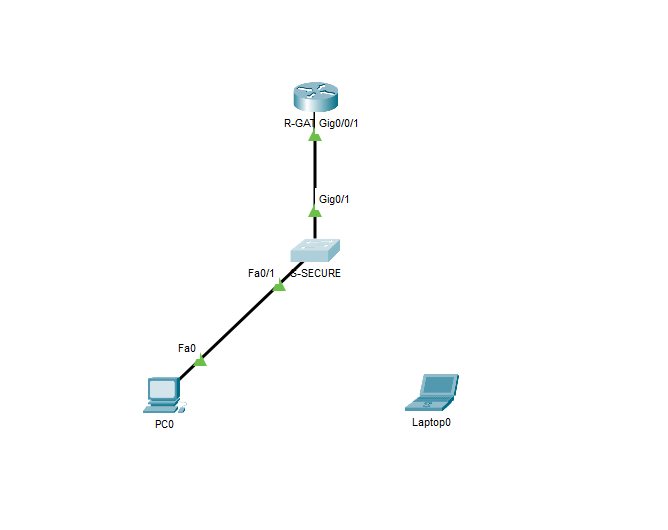
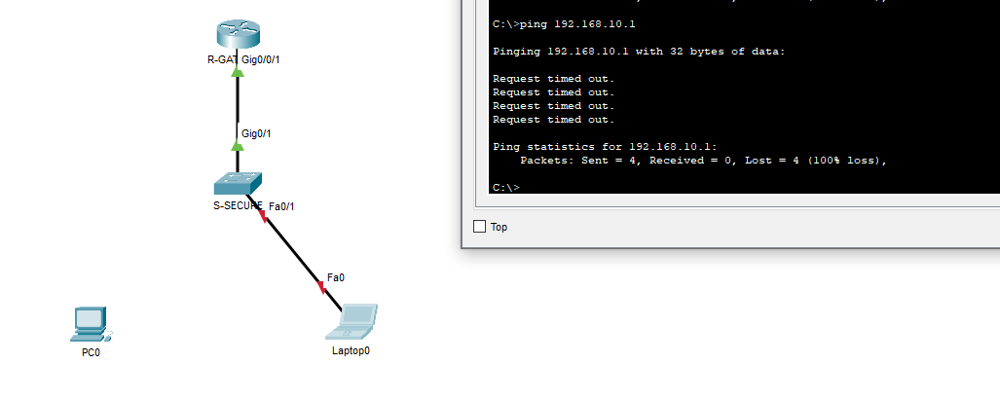
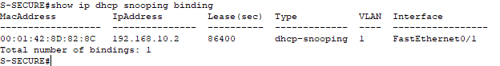
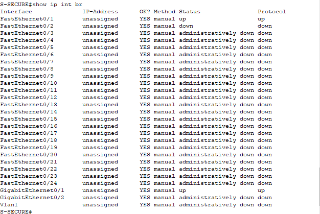

# Sécurité Layer 2 : Hardening & Protection Switch

Ce projet se concentre sur la sécurisation de la couche d'accès (Layer 2) d'une infrastructure réseau.
L'objectif est de prévenir les attaques courantes de type "Man-in-the-Middle" (ARP Spoofing), l'intrusion de périphériques non autorisés et les serveurs DHCP pirates (Rogue DHCP).

## 📂 Topologie

* **S-SECURE :** Switch d'accès Cisco 2960 sur lequel les sécurités sont appliquées.
* **R-GATEWAY :** Routeur et serveur DHCP de confiance.
* **PC-USER :** Poste client légitime.
* **Ports Inutilisés :** Désactivés administrativement pour réduire la surface d'attaque.



## 🛡️ Mesures de Sécurité Implémentées

### 1. Port Security
Limite l'accès physique au réseau. Le port du switch apprend l'adresse MAC du PC légitime (`Sticky`). Si un autre appareil est branché sur ce même port, le switch bloque instantanément le port.
```bash
interface FastEthernet0/1
 switchport mode access
 switchport port-security
 switchport port-security maximum 1
 switchport port-security mac-address sticky
 switchport port-security violation shutdown
```
### 2. DHCP Snooping
Empêche un utilisateur malveillant de brancher son propre routeur/serveur DHCP pour distribuer de fausses adresses IP et détourner le trafic.
* **Trust :** Seul le port vers le routeur officiel (Gi0/1) est autorisé à envoyer des offres DHCP.
* **Untrust :** Tous les ports utilisateurs bloquent les paquets DHCP Server.

### 3. Dynamic ARP Inspection (DAI)
Utilise la base de données du DHCP Snooping pour valider les paquets ARP. Si un attaquant tente de faire de l'ARP Spoofing (usurpation d'identité), le switch rejette le paquet car le couple IP/MAC ne correspond pas à l'enregistrement DHCP officiel.

### 4. Hardening (Désactivation ports)
Tous les ports non utilisés (Fa0/3 à Fa0/24) sont éteints (`shutdown`) et placés dans un VLAN "Parking" (VLAN 999) isolé.

## ✅ Preuves de Fonctionnement

### Violation de Port-Security
Test réalisé en débranchant le PC légitime et en connectant un appareil inconnu (Rogue Laptop). Le port s'est immédiatement coupé (État Down/Down).



### Base de données DHCP Snooping
Le switch a correctement enregistré le PC légitime comme seule source fiable, validant l'activation de la protection.



### État des Interfaces (Hardening)
Vérification que tous les ports inutiles sont bien désactivés ("admin down") pour éviter les branchements sauvages.


