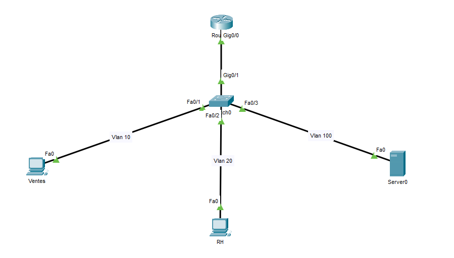
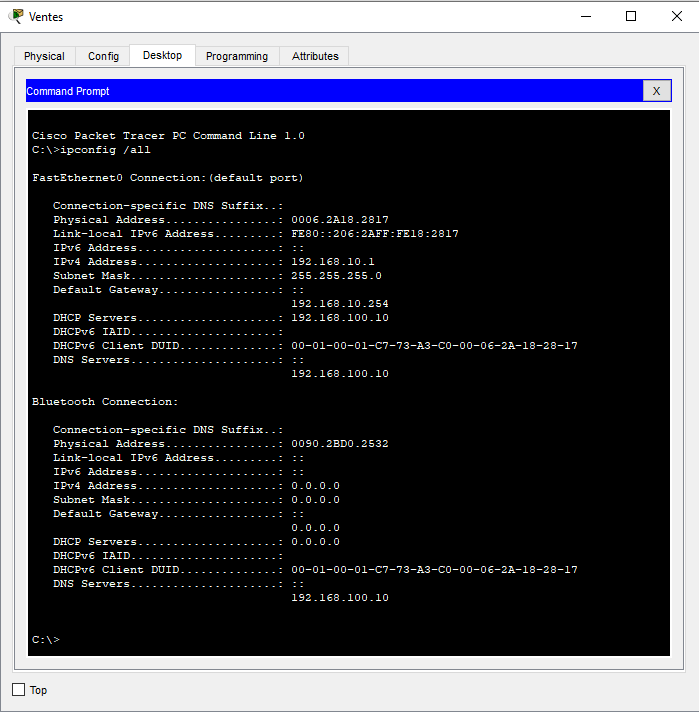
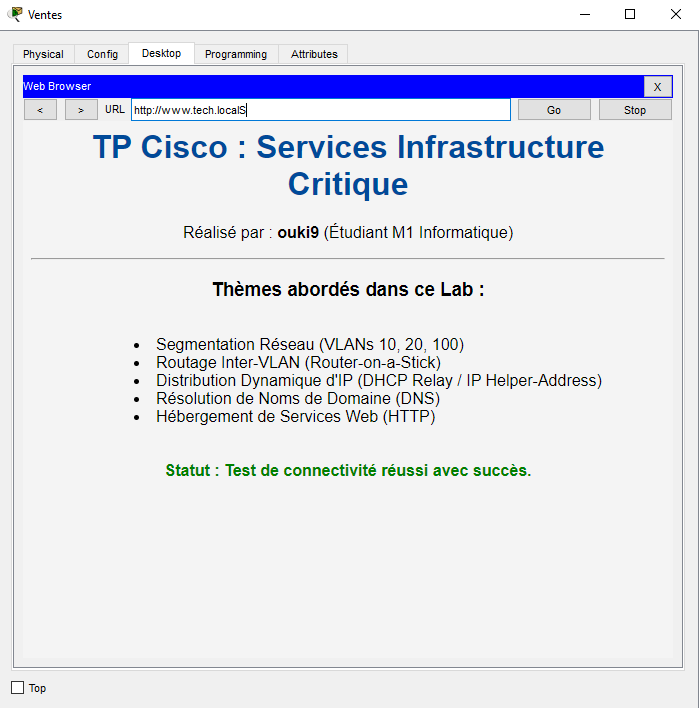

# 04_Infrastructure_Services : DHCP Relay, DNS & HTTP

Ce projet simule la mise en place de services centralisés pour une entreprise multi-VLANs. 
L'objectif est d'automatiser la configuration réseau des hôtes et de permettre l'accès aux ressources internes via des noms de domaine (DNS) plutôt que des adresses IP, tout en gérant le franchissement des routeurs par les requêtes de broadcast.

##  Topologie

* **R1-CORE :** Routeur configuré en "Router-on-a-Stick" (sous-interfaces) servant de passerelle inter-VLAN.
* **S1-DISTRI :** Switch de distribution gérant les VLANs 10 (Ventes), 20 (RH) et 100 (Serveurs).
* **SRV-SERVICES :** Serveur centralisé hébergeant les rôles DHCP, DNS et HTTP.
* **PC-Clients :** Postes de travail configurés en mode dynamique.



##  Configurations & Concepts Clés

### 1. Routage Inter-VLAN (Dot1Q)
Configuration de sous-interfaces sur le lien Trunk pour permettre aux différents départements de communiquer avec le VLAN Serveur.
```bash
interface GigabitEthernet0/0.10
 encapsulation dot1Q 10
 ip address 192.168.10.254 255.255.255.0
 exit
```
### 2. Agent de Relais DHCP (IP Helper)
Le service le plus critique du projet. Il permet de transférer les requêtes DHCP Broadcast des clients (bloquées par défaut par le routeur) vers l'adresse Unicast du serveur distant.

```Bash
interface GigabitEthernet0/0.10
 ip helper-address 192.168.100.10
!
interface GigabitEthernet0/0.20
 ip helper-address 192.168.100.10
```
### 3. Services Réseau (DHCP, DNS & HTTP)
DHCP : Création de pools d'adresses séparés pour chaque VLAN avec attribution automatique de la passerelle et du serveur DNS.

DNS : Configuration d'un enregistrement de type A pour le domaine www.tech.local pointant vers l'IP 192.168.100.10.

HTTP : Personnalisation de la page index.html pour confirmer l'accès à l'intranet.

## Difficulté rencontrée & Solution
Problématique : Lors des tests initiaux, les clients ne recevaient aucune adresse IP. Analyse : J'ai identifié que le routeur stoppait les flux DHCP car il ne relaie pas les broadcasts (Layer 2) par défaut vers d'autres sous-réseaux. Solution : L'implémentation de la commande ip helper-address sur chaque passerelle de VLAN a résolu le problème en encapsulant les requêtes DHCP dans des paquets IP (Layer 3) routables jusqu'au serveur.

## Preuves de Fonctionnement
### État des Interfaces (Routage)
Vérification sur **R1-CORE** montrant que toutes les sous-interfaces sont `up/up` avec leurs adresses IP respectives pour chaque VLAN.

Succès de l'attribution DHCP
Vérification sur un PC du VLAN 10 montrant la réception correcte de l'IP, de la passerelle et surtout de l'adresse du serveur DNS.

Résolution DNS et Service Web
Test de connexion à l'Intranet via le nom de domaine www.tech.local. Le succès de l'affichage de la page personnalisée prouve le bon fonctionnement du routage, du DNS et du service HTTP.

