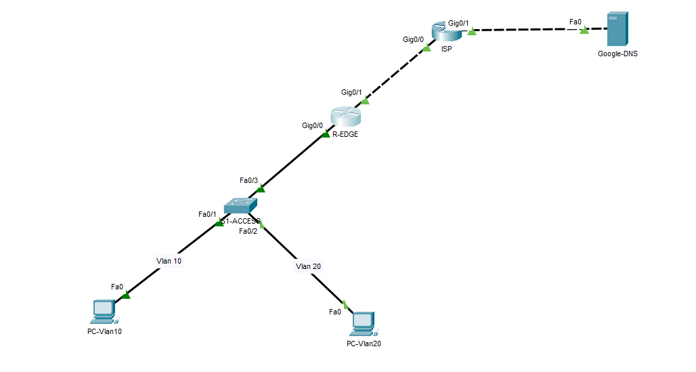
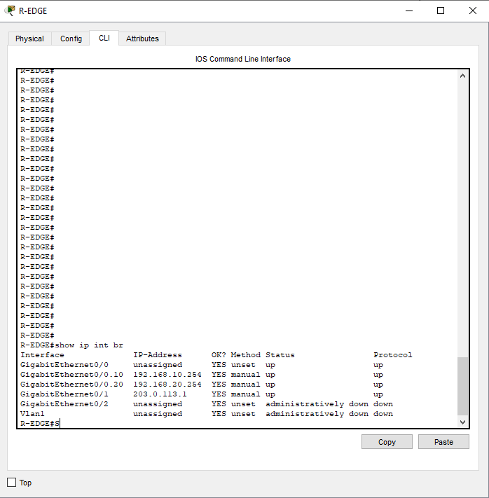
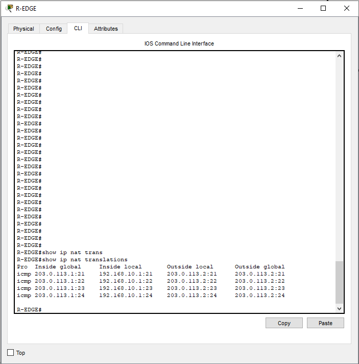
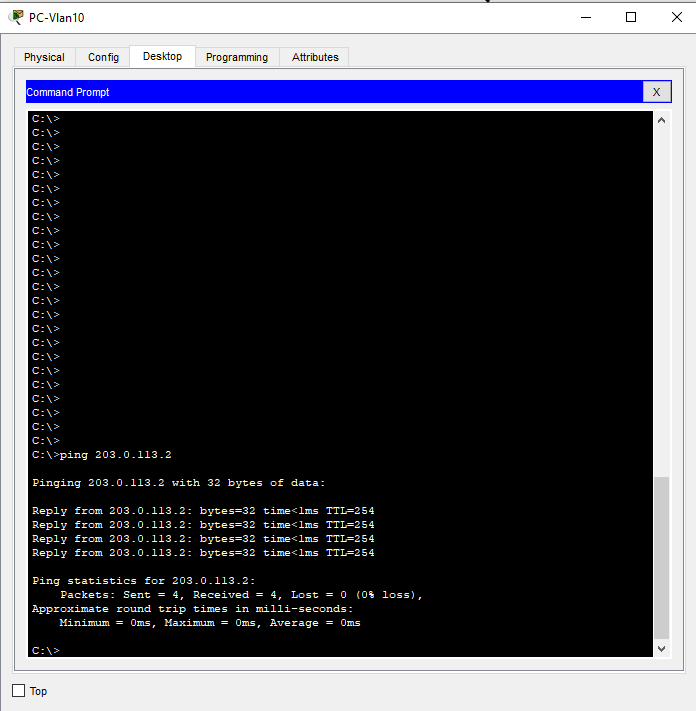

# 05_NAT_PAT_Internet_Access

Ce projet simule l'interconnexion d'un réseau d'entreprise privé avec un Fournisseur d'Accès Internet (ISP). L'objectif principal est de mettre en œuvre la translation d'adresses (NAT/PAT) pour permettre à plusieurs hôtes internes d'accéder au WAN avec une seule adresse IP publique.

## Topologie

* R-EDGE : Routeur de bordure effectuant le NAT et le routage inter-VLAN (Router-on-a-Stick).
* S1-ACCESS : Switch gérant les VLANs 10 (Ventes) et 20 (RH).
* ISP : Routeur simulant le réseau public de l'opérateur.
* GOOGLE-DNS : Serveur distant situé sur Internet (8.8.8.8) servant de cible de test.



## Configurations et Concepts Cles

### 1. Routage Inter-VLAN et NAT Inside
Configuration des passerelles pour les réseaux internes via des sous-interfaces (Dot1Q) et marquage de ces interfaces comme sources internes pour la translation (NAT Inside).

```bash
interface GigabitEthernet0/0.10
 encapsulation dot1Q 10
 ip address 192.168.10.254 255.255.255.0
 ip nat inside
 exit
interface GigabitEthernet0/0.20
 encapsulation dot1Q 20
 ip address 192.168.20.254 255.255.255.0
 ip nat inside
 exit
```

### 2. Configuration WAN et NAT Outside
Définition de l'interface de sortie vers l'ISP (NAT Outside) et activation du PAT (Port Address Translation). Cette étape inclut la création d'une liste de contrôle d'accès (ACL) pour définir les flux autorisés et l'ajout d'une route statique par défaut vers la passerelle de l'opérateur.

```Bash

interface GigabitEthernet0/1
 ip address 203.0.113.1 255.255.255.252
 ip nat outside
 exit
!
access-list 1 permit 192.168.10.0 0.0.0.255
access-list 1 permit 192.168.20.0 0.0.0.255
!
ip nat inside source list 1 interface GigabitEthernet0/1 overload
ip route 0.0.0.0 0.0.0.0 203.0.113.2
```

## Difficulte rencontree et Solution
Problematique : Lors des tests de connectivité vers Internet, les paquets quittaient bien le réseau local mais aucune réponse ne revenait aux clients. Analyse : L'examen de la configuration a montré que le routeur ISP ne possédait pas de route de retour vers les réseaux privés et que la route par défaut du routeur R-EDGE pointait vers une interface physique au lieu de l'IP du prochain saut. Solution : Correction de la route statique vers l'IP de la passerelle ISP (203.0.113.2) et vérification du NAT Overload qui permet de masquer les IPs privées derrière une IP publique routable.

## Preuves de Fonctionnement

### Etat du Routeur de Bordure
Verification sur R-EDGE montrant que les sous-interfaces LAN et l'interface WAN sont operationnelles.


### Table de Translation NAT
La commande show ip nat translations confirme que l'adresse source privee (192.168.10.1) est bien traduite en adresse publique (203.0.113.1) lors de l'envoi du paquet vers l'exterieur.


### Connectivite WAN (Ping 8.8.8.8)
Test de ping reussi depuis un PC du VLAN 10 vers le serveur distant 8.8.8.8, validant ainsi toute la chaine de communication.

